# Introduction to flexdashboard and shiny

Yuezhu Xu and Zhengyi Fang

## Motivation
We can use various packages in R to do nicely arranged graphs. But when it comes to presenting graphs under certain limit or choice regarding to different numerical or categorical variables, it is hard to realize it on a non-interactive board. In fact, such interaction is essential when clients want to explore data themselves. Here we would like to introduce a handy package __flexdashboard__ combined with __shiny__ to realize the function. The output will be a website on which people can do a series of operation, like filtering, sorting and changing aesthetics, according to their needs. 

## Introduction
### Environment Setting
To get stared, we first set the environment as follows.

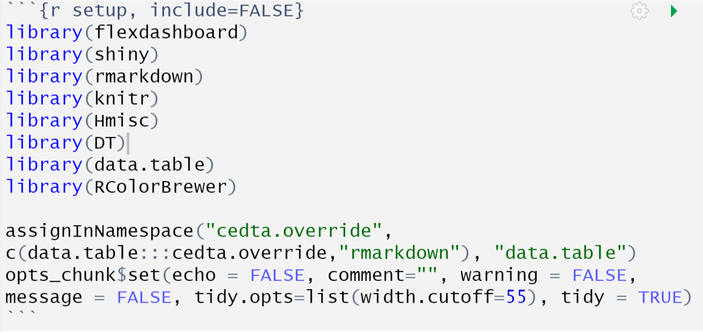{width=50%}

Note that we use __data.table__ as the tool to deal with data. You can refer to 
https://cran.r-project.org/web/packages/data.table/vignettes/datatable-intro.html for further instruction.

### Basic Layout
We need to be familiar with the layout __flexdashboard__ provide. For a website, we can design several pages on it by separating different part using long set of "=" and name the page before it. Also, on one page, we can separate the interface them into multiple sections by long set of "-". If we add Column (Row) before it, it will divide a column (Row) space for us. In each section, we can assign difference parts using ### and name the part after ###. See the following example. 

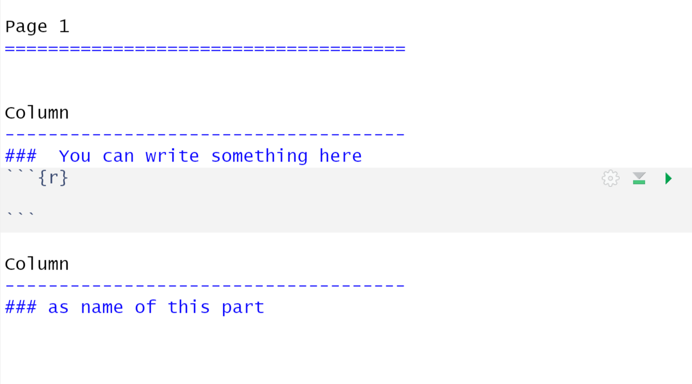{width=40%} 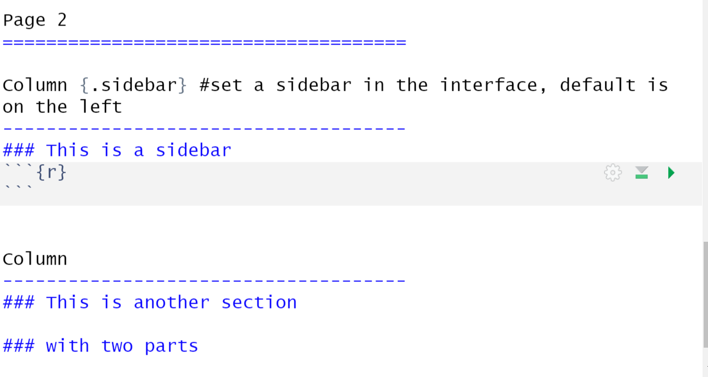{width=40%}

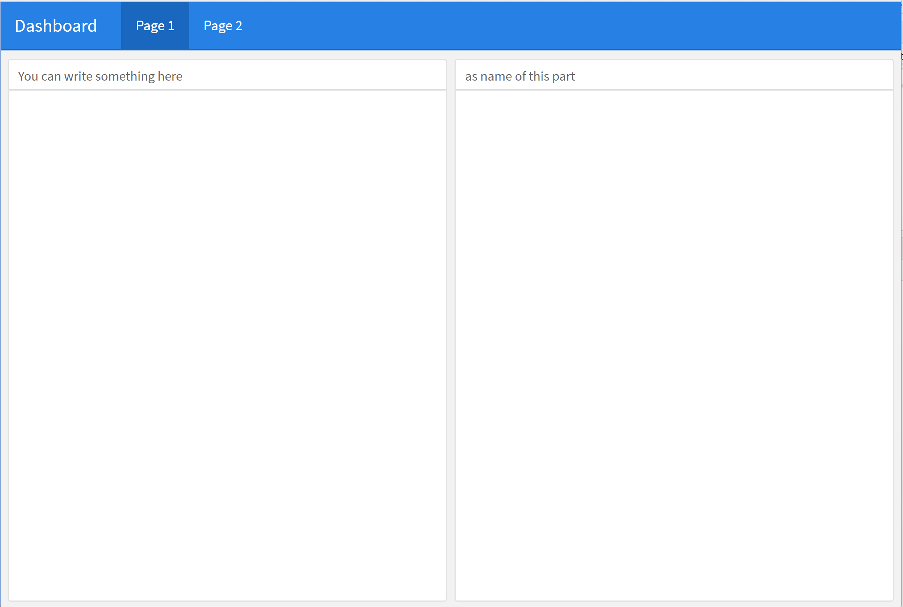{width=40%} {width=40%}

### Common Components
After we are familiar with the layout, let us see the common components making up the website. 

#### ValueBox
A valuebox is a bar that contains descriptive information (name of the bar) and a number in it. We can create one by calling __valueBox__() and put the number in ().

{width=60%}

#### Input & Graph
To create an interactive graph. We need two parts: the __Input__ for users to filter and choose and the responding graph. We first introduce the __Input__. For categorical variables, the form can be a drop-down (only one of the choice can be chosen) or a filled blank (can choose multiple choices). In the example below, user can choose one of the choice in the upper drop-down by clicking (E.g. Awareness) and choose multiple choices by deleting unwanted ones (E.g. Deleting Male if you only want to observe the data of female and keeping both Male and Female if you want to observe all people). 

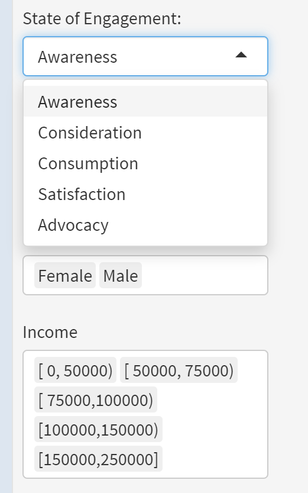{height=300px}

Also we can have check box as categorical input and users can click to choose them to show related feature. It looks like below.

{height=80px}

For numerical data, the form is an slider with numbers on it. The min, max and step of the silder can be set according to the data. The numerical panel looks like below.

{height=150px}

In this tutorial, we take bar plot as the example. You can do other graphs such as scatter plot in the same way. Note that panel can not only set parameter and limitation to graphs but also can be used to control elements in other components like table. The realization will be mentioned in the __Typical Function__ part. 

#### Table
Another commonly-used element is table. We can set connections between panel and the data set to do filtering and limitation on the data set. After the process, we obtain a new dataframe for table and we can create a table simply by calling __datatable__(new dataframe).

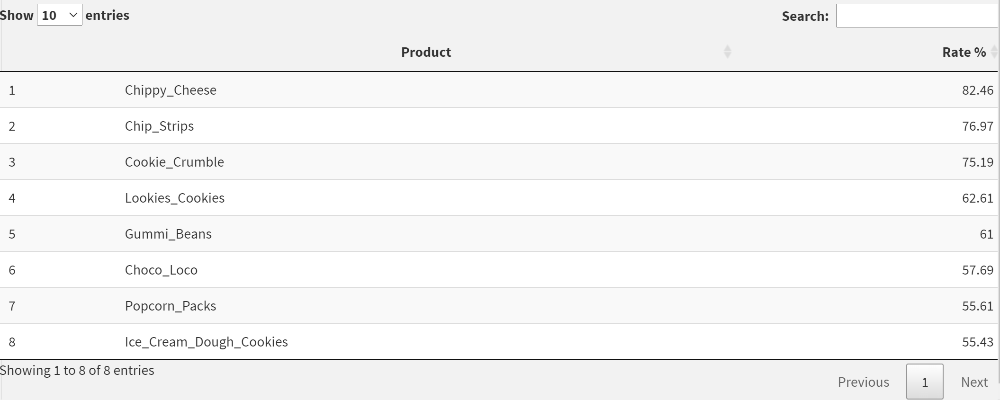{width=70%}

### Typical Function 
We use snack.dat dataset in library(formulaic). It has 23000 rows and 23 columns containing information from the (fictionalized) marketing survey’s data. (https://rdrr.io/cran/formulaic/man/snack.dat.html). After pre-processing, our dataframe looks like below. 
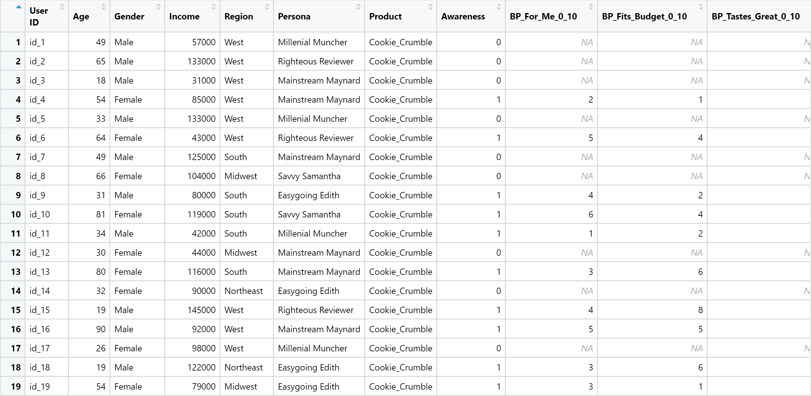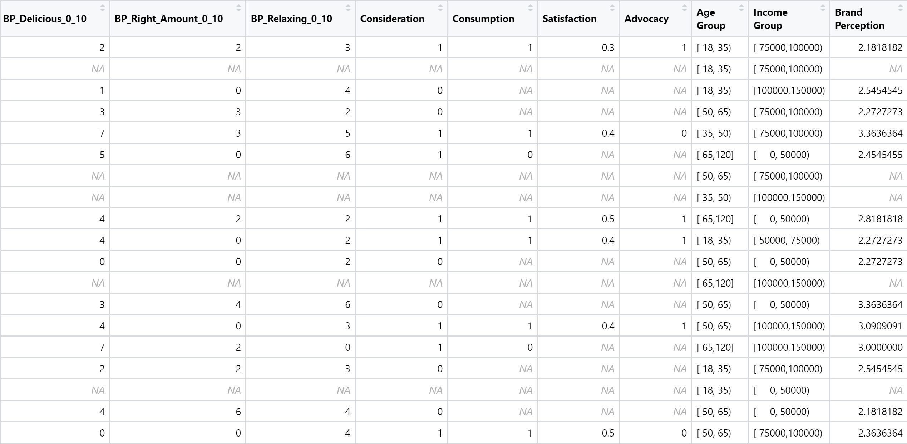

Basically we realize the following function by building connections between __Input__ and its controlled component. We can put several Inputs in one panel. To realize this, we call inputPanel() and put Input in it. Common type of __Input__ includes drop-down/filled blank, check box and slider as discussed and we call them by __selectInput__, __checkboxInput__ and __sliderInput__ separately and give them Id in the call. With the Id, we can connect them to their controlled components and adjust the output accordingly. We introduce these four typical function in combined examples as follows. The final dashboard can be seen at https://zhengyi-fang.shinyapps.io/Dashboard/#section-introduction. 

#### Choosing on Categorical Variable (drop-down) and Numerical Variable
In this example, we have two choices for the drop-down: "Age" and "Income" to observe the distribution of data on either age or income. Also, we put two slider here. We can adjust bin width for age on the first slider and for income on the second slider. We can certainly use one slider to adjust the bin width for different data according to the choice in the drop-down. But here, as the range of age and income differ so much, we choose to realize it in different sliders. The Input and the code are as follows

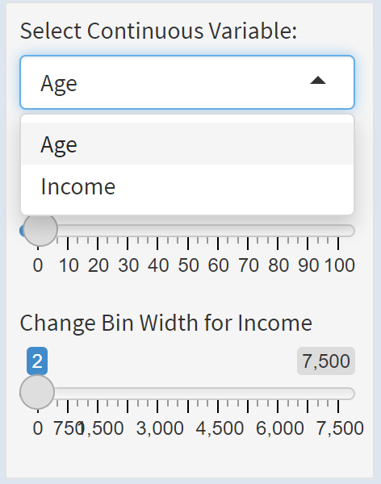{height=200px} {width=65%}

Inside the inputPanel(), we add one __selectInput__ and two __sliderInput__. Inside each input, we give the input an id by "InputId = ". We label them by "label = " with descriptive text. For selectInput, we set the choices by "choices = " filling in an array of character and assigning the default choice by "selected = ". Here we choose the first one. For sliderInput, we define the min, max, default choice and step by "min = ", "max = ", "value = " and "step = " separately. 
Here comes the graph part. We call __renderPlot__ to do the plot and add connections by passing Id defined in the Input to parameters in renderPlot.

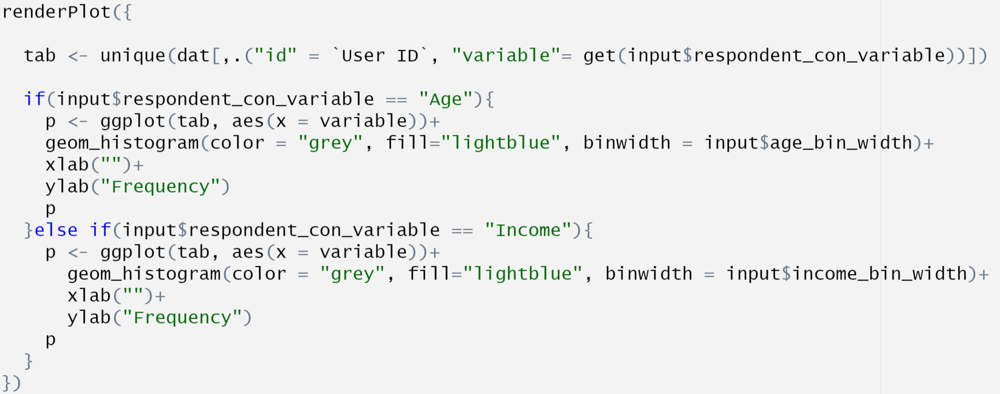{width=65%}

Inside the renderPlot, we first integrate the dataframe dat by selecting data for desirable category: age or income. Concretely, we pass the parameter to "variable" within get function (see https://www.rdocumentation.org/packages/base/versions/3.6.2/topics/get) and the parameter is obtained by "input\$respondent_con_variable". The parameter can be either 'Age' or 'Income' depending on user's selection. The "input" refers to the InputPanel and "respondent_con_variable" is the id of of the drop-down Input. Similarly, we can obtained the parameter binwidth in two geom_histogram by "input\$age_bin_width" and "input\$income_bin_width". Then, we decide the output plot according to the choice in the drop-down with the corresponding binwidth assigned by the slider. Below are the two circumstances: 1. selecting "Age" and 20 for binwidth, 2. selecting "Income" and 3000 for binwidth. Note that users can adjust the parameter by themselves so that they will not miss important information because of improper choice of binwidth.

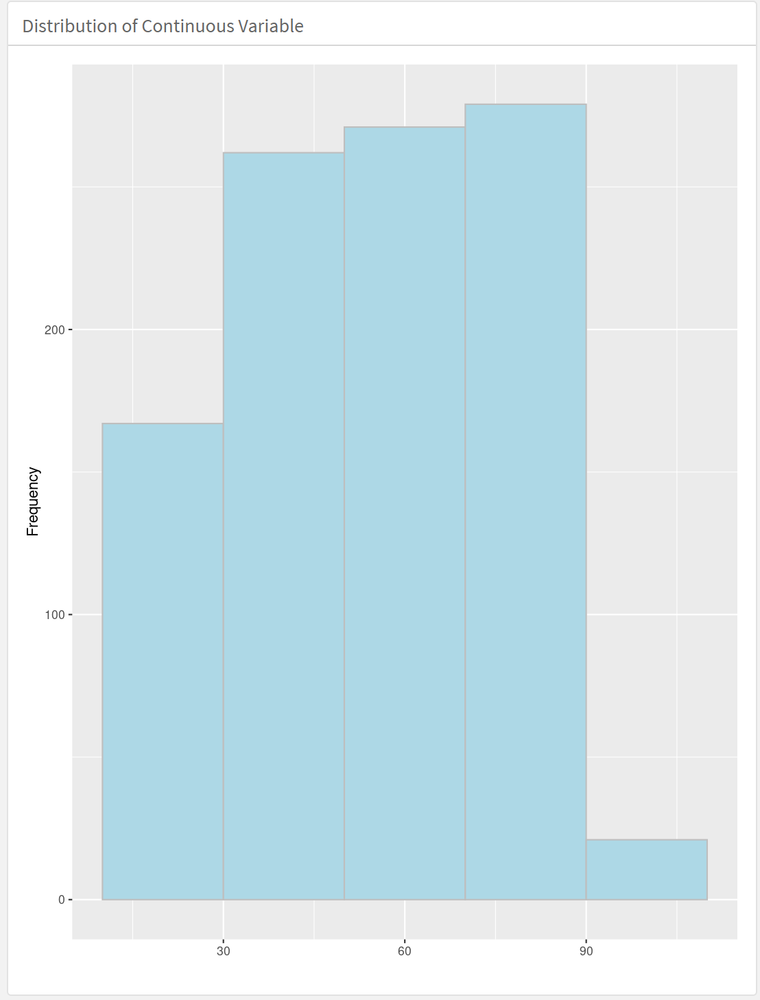{height=360px}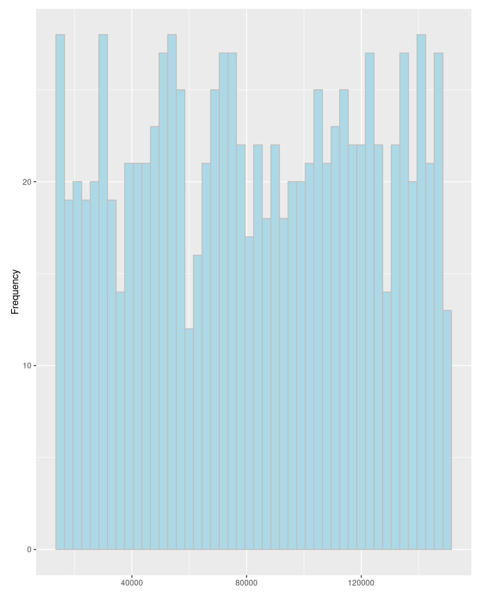{height=360px}

#### Adding numbers to bar plot and Sorting
In this example, we put a drop-down and two check boxes here. The drop-down decides the object we study and the check boxes decides whether to sort the bat plot and whether to show the actual counts or not. We create the Input as follows. 

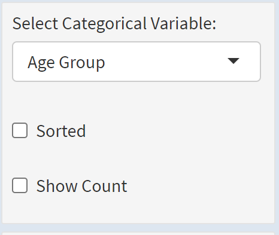{height=150px}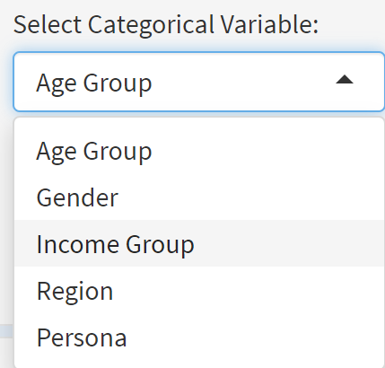{height=150px}

{width=60%}

The new component here is checkbox. We create one by calling __checkboxInput__. Similarly, we give it an id through "inputId = " and label it with descriptive text through "label = "
Also, we set the default option by "value = FALSE" here indicating that initially it is not chosen. The sorting and showing numbers function are realized as below.

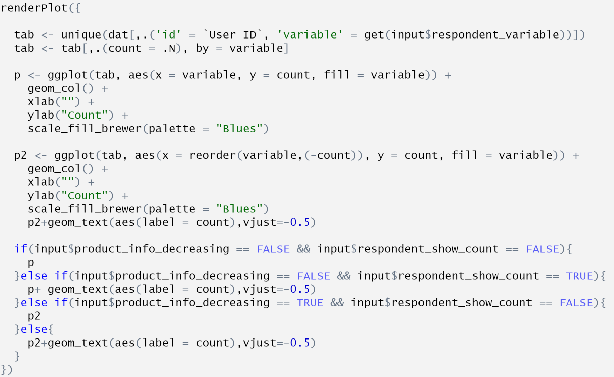{width=60%}

We give two examples for different user's selections: 1. choosing "Income Group", sorting and not showing numbers, 2. choosing "Age Group", not sorting and showing numbers

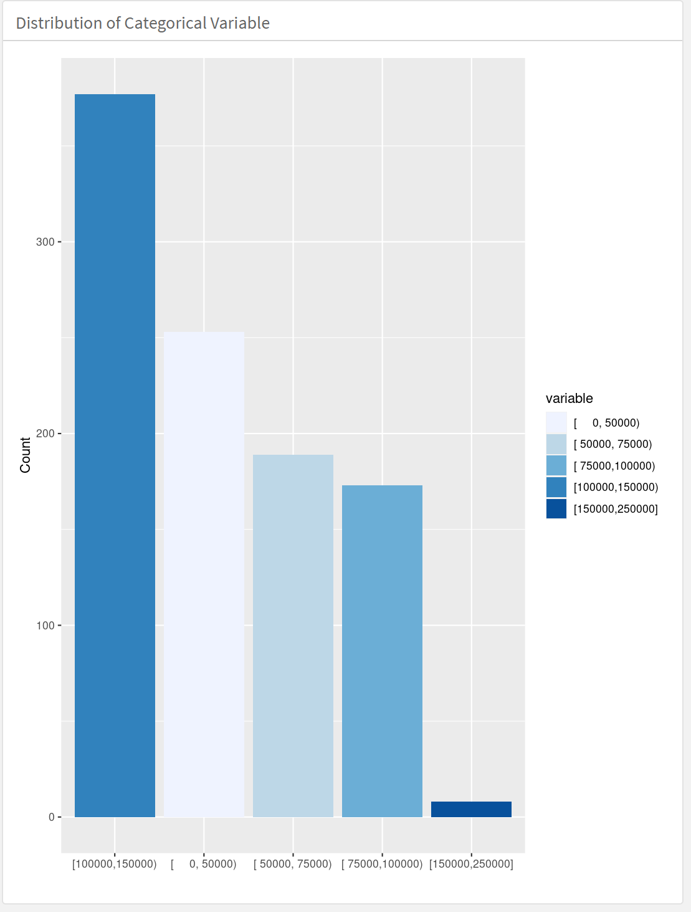{height=360px}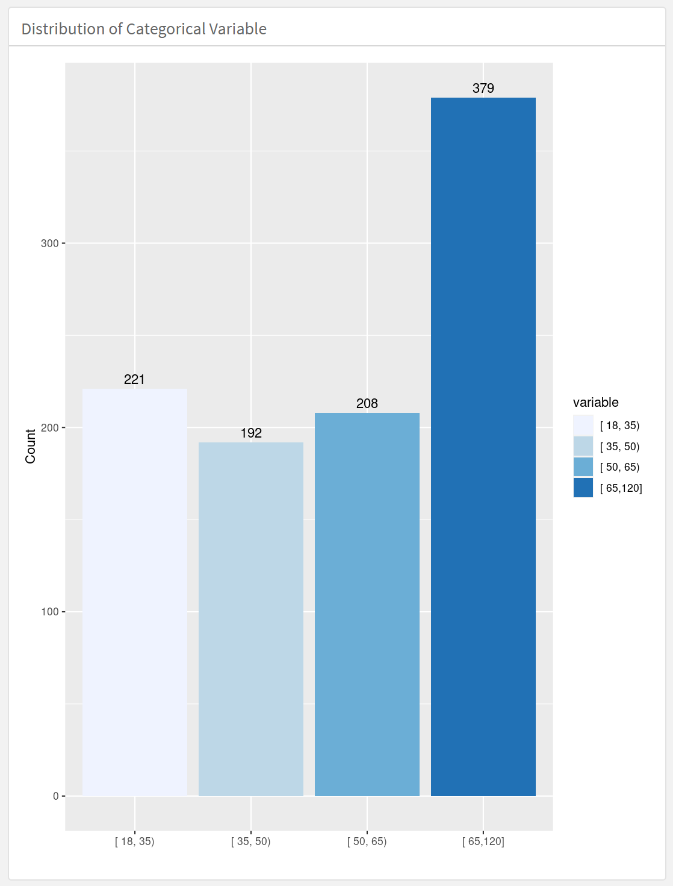{height=360px}

#### Choosing on Categorical Variable (filled blank) and changing Aesthetic
We combine drop-down, filled blank and slider in this case. User can choose one of the five types in "State of Engagement", decide multiple desirable choices in "Age", "Gender", "Income", "Region" and "Persona" and rotate the label on x-axis to avoid text from overlapping. We realize the Input as follows.

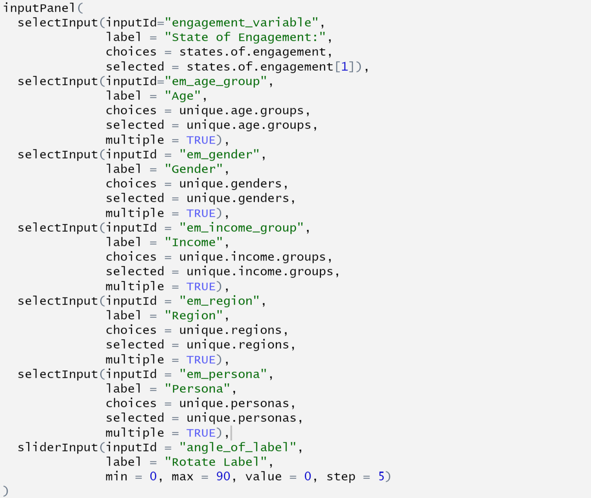{height=480px} {height=480px}  

For the Input, the only thing new here is the filled blank. In fact, drop-down and filled blank share the same call __selectInput__. The difference is the parameter "selected" in it. Recall that "selection" decides the default choice in drop-down. If we assign a single option to "selected", like "states.of.engagement[1]" in the first selectInput here, it will automatically turn out to be a drop-down. On the other hand, if we assign an array of choices, like "unique.genders" in the second selectInput (which is the array of all choices), it will turn out to be a filled blank and the default is the array you assign. 

To realize the new function on aesthetic: rotating the label on x-axis, we pass the number on the slider for the angle of rotation to the parameter "angle" by calling "input\$angle_of_label", which is the id of the slider.
Below is an example with users' selection shown on the left and the correspondign graph shown on the right.

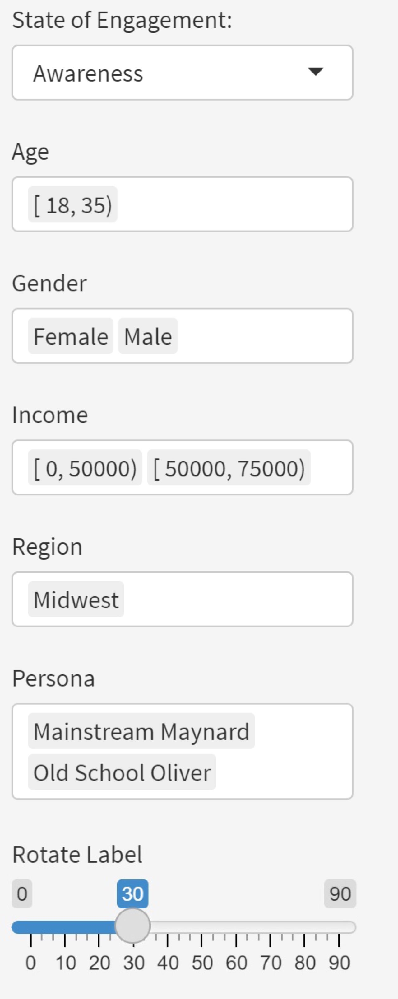{height=400px}  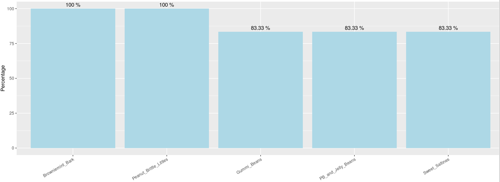{width=700px height=350px}

## Conclusion 
We introduce the layout, commonly-used components and several typical functions explaining how they works from scratch in this tutorial. Hopefully it is novice-friendly and can help you with using __flexdashboard__ along with __shiny__.

## Citation
data.table : https://cran.r-project.org/web/packages/data.table/vignettes/datatable-intro.html

get function: https://www.rdocumentation.org/packages/base/versions/3.6.2/topics/get 

flexdashboard: https://blog.rstudio.com/2016/05/17/flexdashboard-easy-interactive-dashboards-for-r/

shiny: https://shiny.rstudio.com/images/shiny-cheatsheet.pdf
